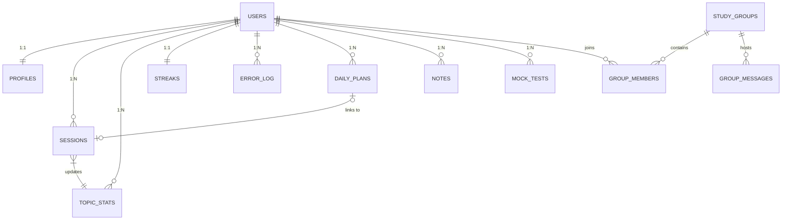
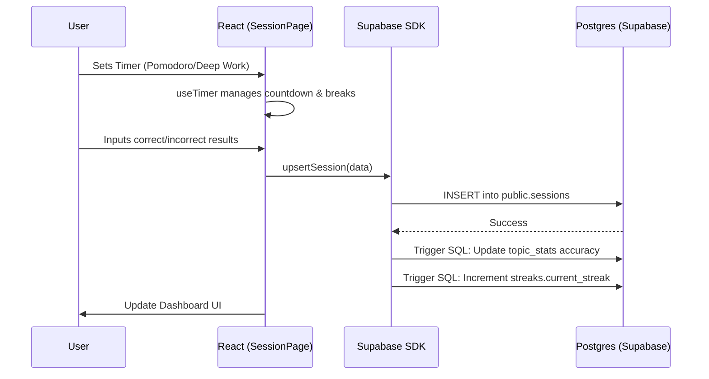

# CAT 2026 Study Tracker — Technical Logic & Architecture

Welcome to the comprehensive technical transfer documentation for the **CAT 2026 Study Tracker**. This document details the architectural decisions, data structures, and operational workflows of the application.

---

## 🛠 1. The Technology Stack

| Layer | Technology | Version | Purpose |
|---|---|---|---|
| **Core** | React | 18.2 | Component-based UI logic. |
| **Build Tool** | Vite | 5.x | Fast HMR and bundling. |
| **Backend/BaaS** | Supabase | - | Auth, Postgres DB, Realtime, and Edge Functions. |
| **Database** | PostgreSQL | 15.x | Relational storage with RLS security. |
| **Styling** | Vanilla CSS | - | High-performance, low-latency custom design. |
| **Animations** | Framer Motion | 11.x | Premium UI transitions and micro-interactions. |
| **Icons** | Lucide React | 0.x | High-fidelity iconography. |
| **Charts** | Recharts | 2.x | Performance and accuracy visualization. |
| **Routing** | React Router | 6.x | Client-side page navigation. |

---

## 🏗 2. System Architecture & Modules

The application is structured as a **Single Page Application (SPA)** with a modular design.

### **Folder Structure Map**
- `src/context/`: Global state providers (**Auth**, **Theme**, **Toast**).
- `src/services/`: The **API Layer**. Centralized functions in `db.js` for all Supabase interactions.
- `src/data/`: Static configuration (**Syllabus**, **Badge definitions**).
- `src/hooks/`: Reusable logic (**useTimer**, **useInsights**).
- `src/pages/`: Business logic modules.
    - `Dashboard`: Aggregated stats and daily highlights.
    - `Session`: Core tracking engine (Timer + Result logging).
    - `Social`: Peers, Group chat, and Leaderboards.
    - `MockTests/Analytics`: Historical performance tracking.
    - `Notes/Formula`: Knowledge management hub.

---

## 💾 3. Database Architecture (The Schema)

The database is built on **PostgreSQL**. Tables are interlinked via Foreign Keys (FK) and protected by Row Level Security (RLS).

### **ER Diagram**

### **Detailed Table Breakdown**

| Table Name | Description | Primary Key | Interlinking (FKs) |
|---|---|---|---|
| **`profiles`** | User profile & goals. | `id` (Matches `users.id`) | `id` -> `auth.users.id` |
| **`sessions`** | Raw study logs. | `id` | `user_id` -> `auth.users` |
| **`topic_stats`** | Aggregated topic mastery. | `id` | `user_id` -> `auth.users` |
| **`streaks`** | Gamification state. | `user_id` | `user_id` -> `auth.users` |
| **`daily_plans`** | Tasks set by the user. | `id` | `user_id` -> `auth.users` |
| **`notes`** | Summaries and formulas. | `id` | `user_id` -> `auth.users` |
| **`mock_tests`** | Exam score tracking. | `id` | `user_id` -> `auth.users` |
| **`friendships`**| P2P social connections. | `id` | `user_id`, `friend_id` -> `profiles.id` |
| **`group_messages`**| Chat history. | `id` | `group_id` -> `study_groups.id` |

---

## 🔄 4. Core Workflow Logic

### **The Study Loop (Front-to-Back)**

---

## 🔌 5. Data Connectivity & API Layer

The frontend communicates with the backend via two primary channels:

1.  **PostgREST API (CRUD)**:
    - Facilitated by the `supabase-js` SDK.
    - All queries pass through `db.js`.
    - **Security**: Supabase checks the `Authorization` header against Row Level Security (RLS) policies. A user can only access rows where `auth.uid() = user_id`.

2.  **Realtime Broadcast (WebSockets)**:
    - Used in the **Social Hub**.
    - Frontend subscribes to `public:group_messages` where `group_id` matches current view.
    - **Workflow**: `User sends message` -> `INSERT to group_messages` -> `Supabase triggers Realtime Event` -> `All subscribers' UI updates instantly`.

---

## 📊 6. Module Functionality Detail

### **A. Session Tracker**
- **Logic**: Not just a timer, but a data point generator.
- **Auto-Revision**: If a session's accuracy is below 60%, logic in the `Session` end-modal calls `upsertRevisionQueue`, scheduling a review for `Date.now() + 1 day`.

### **B. Analytics Engine**
- **Calculation**: Uses `topic_stats`. Accuracy is calculated as `(total_correct / total_attempted) * 100`.
- **Subject mapping**: Every `topic_id` maps to a subject (QA/DILR/VARC) via the `syllabus.js` config.

### **C. Custom Theme Engine**
- **Persistence**: Theme selection (`light` / `dark`) is stored in `localStorage`.
- **Injection**: `ThemeContext` injects a `data-theme` attribute on the `<html>` tag, which switches the CSS variables in `global.css`.

---

## 🛠 7. Setup & Maintenance

### **Deployment Readiness**
- **Environment Variables**: Requires `VITE_SUPABASE_URL` and `VITE_SUPABASE_ANON_KEY`.
- **Database Migrations**: Run the content of `supabase_migration.sql` in the Supabase SQL Editor.
- **Maintenance**: To add new CAT topics, update the `ALL_TOPICS` array in `src/data/syllabus.js`.

---

**CAT 2026 Tracker** — Robustly architected for the data-driven student.
